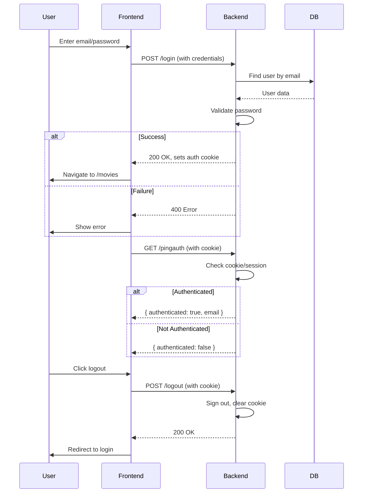
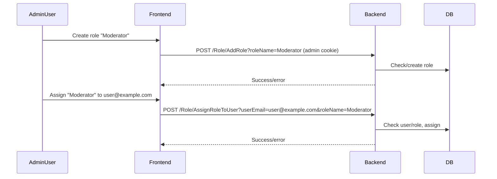

# Authentication & Authorization System Overview

---

## Backend (ASP.NET Core)

### Authentication

- **Type:** Cookie-based (persistent/session)
- **Framework:** ASP.NET Core Identity
- **Storage:** SQLite (`ApplicationDbContext`)
- **Endpoints:**
  - `POST /login` — Validates credentials, sets auth cookie
  - `POST /register` — Creates user, sets auth cookie
  - `POST /logout` — Signs out, clears cookie
  - `GET /pingauth` — Returns `{ authenticated, email }`
- **Middleware:**
  - Configured for cookie auth, CORS with credentials
  - Custom claims via `CustomUserClaimsPrincipalFactory`
- **No JWT tokens used**

### Authorization

- **Role Management:**
  - `RoleController` (protected by `[Authorize(Roles = "Administrator")]`)
    - `POST /Role/AddRole?roleName=...`
    - `POST /Role/AssignRoleToUser?userEmail=...&roleName=...`
  - Roles stored in Identity DB
- **Role Enforcement:**
  - **Only** on `RoleController`
  - No other `[Authorize]` attributes found
- **User Data:**
  - `UserRecommendationsController` unrelated to auth

---

## Frontend (React + TypeScript)

### Login Flow

- Submits credentials to `/login`
- Backend sets auth cookie
- Navigates to `/movies`
- No token storage

### Auth Status Check

- Calls `/pingauth`
- Updates auth state accordingly
- Conditionally renders protected content

### Logout Flow

- **Current:**
  - Clears local React state
  - Redirects to `/`
  - **Does NOT call backend `/logout`**
  - Leaves backend session cookie valid
- **Recommendation:**
  - Call backend `/logout` endpoint to invalidate session
  - Then clear frontend state and redirect

---

## Data Flow Diagram

---

## Role Management Diagram

---

## Edge Cases Considered

- Invalid credentials
- User not found
- Expired/invalid cookie
- Cross-origin requests
- Role assignment errors
- Registration errors
- Frontend refresh restoring auth state
- Logout not invalidating backend session (recommendation to fix)

---

# Summary

- **Backend:** Cookie-based auth, role management protected by "Administrator" role
- **Frontend:** Relies on cookies, no explicit token handling
- **Logout:** Needs improvement to call backend `/logout`
- **Authorization:** Minimal, mostly on role management
- **Security:** Consider adding more `[Authorize]` attributes and explicit logout call