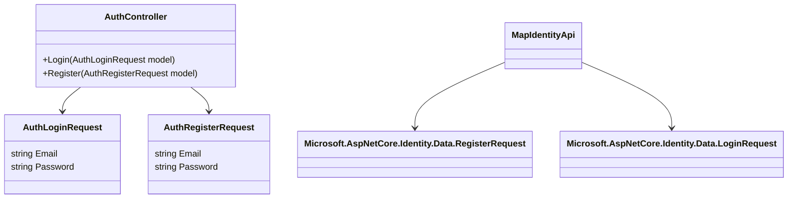

# Fixing Swagger Schema ID Conflict in ASP.NET Core Identity + Custom AuthController

## Root Cause

- Duplicate class names `RegisterRequest` and `LoginRequest`:
  - Nested inside your `AuthController`
  - And in `Microsoft.AspNetCore.Identity.Data` (used by `MapIdentityApi`)
- Swagger generates schema IDs based on class names by default, causing a conflict.

---

## Solution Plan

### 1. Rename Nested Request Classes

| Old Name          | New Name               |
|-------------------|------------------------|
| `LoginRequest`    | `AuthLoginRequest`     |
| `RegisterRequest` | `AuthRegisterRequest`  |

Update the controller method signatures accordingly.

---

### 2. Configure Swagger to Use Fully Qualified Schema IDs

Modify Swagger configuration in `Program.cs`:

```csharp
builder.Services.AddSwaggerGen(c =>
{
    c.CustomSchemaIds(type => type.FullName);
});
```

This ensures future-proofing against similar naming conflicts.

---

## Implementation Details

### AuthController.cs

- Rename nested classes:

```csharp
public class AuthLoginRequest
{
    public string Email { get; set; } = string.Empty;
    public string Password { get; set; } = string.Empty;
}

public class AuthRegisterRequest
{
    public string Email { get; set; } = string.Empty;
    public string Password { get; set; } = string.Empty;
}
```

- Update method parameters:

```csharp
public async Task<IActionResult> Login([FromBody] AuthLoginRequest model)
public async Task<IActionResult> Register([FromBody] AuthRegisterRequest model)
```

---

### Program.cs

Replace:

```csharp
builder.Services.AddSwaggerGen();
```

With:

```csharp
builder.Services.AddSwaggerGen(c =>
{
    c.CustomSchemaIds(type => type.FullName);
});
```

---

## Visual Overview



---

## Summary

- Rename nested request classes to `AuthLoginRequest` and `AuthRegisterRequest`.
- Update controller method parameters.
- Configure Swagger to use fully qualified type names for schema IDs.
- This will resolve the conflict and prevent future schema ID collisions.