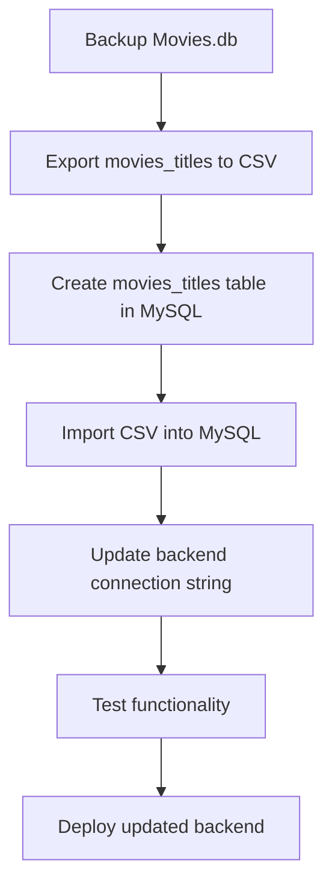

# Migration Plan: SQLite `Movies.db` to AWS RDS MySQL

---

## 1. Preparation
- **Provision AWS RDS MySQL instance**
  - Choose instance size, storage, configure security groups.
  - Enable backups, multi-AZ if needed.
  - Note endpoint, username, password, database name.
- **Backup existing SQLite database**
  - Copy `backend/Movies.db` to a safe location.

---

## 2. Design MySQL Schema

Create database (e.g., `moviesdb`) and table:

```sql
CREATE TABLE movies_titles (
    show_id VARCHAR(255) PRIMARY KEY,
    type VARCHAR(255),
    title VARCHAR(255),
    director VARCHAR(255),
    cast TEXT,
    country VARCHAR(255),
    release_year INT,
    rating VARCHAR(50),
    duration VARCHAR(50),
    description TEXT,
    genre VARCHAR(255)
);
```

---

## 3. Data Migration

- **Export from SQLite:**

```bash
sqlite3 backend/Movies.db
.headers on
.mode csv
.output movies_titles.csv
SELECT * FROM movies_titles;
.quit
```

- **Import into MySQL:**

```sql
LOAD DATA LOCAL INFILE 'movies_titles.csv'
INTO TABLE movies_titles
FIELDS TERMINATED BY ','
ENCLOSED BY '"'
LINES TERMINATED BY '\n'
IGNORE 1 LINES;
```

- **Verify data integrity**

---

## 4. Backend Update

- **Update connection string** in `appsettings.json`:

```json
"ConnectionStrings": {
  "MovieDbContext": "server=your-rds-endpoint;port=3306;database=moviesdb;user=youruser;password=yourpassword"
}
```

- **Update EF Core provider:**

```csharp
services.AddDbContext<MovieDbContext>(options =>
    options.UseMySql(Configuration.GetConnectionString("MovieDbContext"),
                     ServerVersion.AutoDetect(Configuration.GetConnectionString("MovieDbContext"))));
```

- **Add MySQL EF Core NuGet package** (`Pomelo.EntityFrameworkCore.MySql`).

---

## 5. Testing

- Verify all movie-related features.
- Check CRUD operations.
- Integration test with frontend.
- Validate data consistency.

---

## 6. Deployment

- Deploy backend with updated config.
- Monitor logs and performance.
- Retain SQLite backup for rollback.

---

## Migration Flow Diagram



---

## Optional Enhancements
- Add indexes based on query patterns.
- Implement caching if needed.
- Set up automated backups and monitoring on RDS.